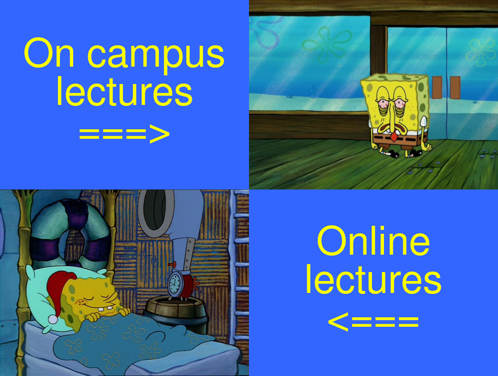

# Assignment 1
## Welcome to my Assignment 1 website!!!
Below is a meme I have created using Rstudio and the [magick](https://cran.r-project.org/web/packages/magick/vignettes/intro.html) package.




```
library(magick)
campus_text <- image_blank(width = 500, height = 381, color = "#3366ff") %>%
  image_annotate(text = "On campus\nlectures\n===>", color = "#ffff00", size = 80, gravity = "center")

online_text <- image_blank(width = 500, height = 375, color = "#3366ff") %>%
  image_annotate(text = "Online\nlectures\n<===", color = "#ffff00", size = 80, gravity = "center")

sb_sleep <- image_read("https://64.media.tumblr.com/d8cdf0578b1184d4d5877c60b12e2ddc/tumblr_p55fr3sc4q1vbooiso1_640.png") %>%
  image_scale(500)

sb_tired <- image_read("https://plantillasdememes.com/img/plantillas/bob-esponja-cansado11592717572.jpg") %>%
  image_scale(500)

top_row <- image_append(c(campus_text, sb_tired))
bottom_row <- image_append(c(sb_sleep, online_text))

sb_vector <- c(top_row, bottom_row)
meme_image <- image_append(sb_vector, stack = TRUE)
meme_image
```
**The process:**
This meme was created by combining two online images and two annotated squares using the `c()` function. Each image and square were set to 500 pixels in size so that the final product would be a 1000 pixel square image containing the four smaller images. However an issue that came up was that both online images were not square, resulting in only the widths being 500 pixels and the heights being around 300-400 pixels. To fix this issue, I adjusted only the height of the top and bottom row squares to the same height as its corresponding image. This still made the overall meme 1000 pixels wide but it was shorten to 756 pixels.

**This meme was created with the idea of:**
1. *Viewing the top left text first*
2. *Then across to the top right image*
3. *Then below to the bottom right text*
4. *And finally across to the bottom left image*

I formatted the meme to have the images and text alternate so it would contrast better and look even. As a result, the viewing experience goes in a cycle rather than going left to right twice.

**Inspiration for creating the meme:**
* *Somewhat shows how I'm coping with life*
* *Relateable for a lot of students*
* *Spongebob is cool*


